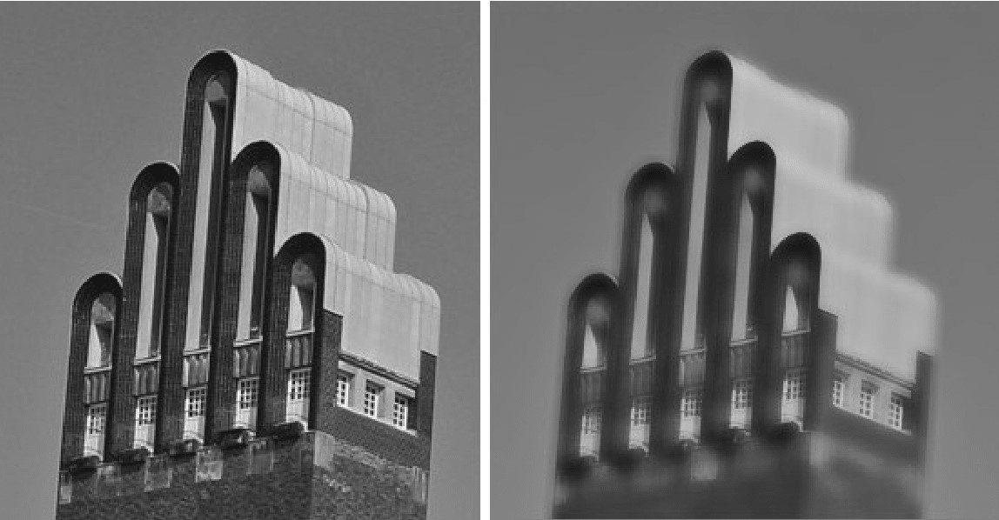

<!-- PROJECT LOGO -->
 

  

  <h1 align="center">Systemnahe und Parallele Programmierung</h1>

  

  <h2>Technische Universität Darmstadt</h2>
    Winter Semester 2020/21
  

<!-- TABLE OF CONTENTS -->

  
Inhaltübersicht

  <ol>
    <li>
      <a href="#about-the-project">Projekt Beschreibung und Algorithmus</a>
    </li>
    <li>
      <a href="#Contact">Kontakt</a>
    </li>
  </ol>

<!--  ABOUT THE PROJECT -->
## Projekt Beschreibung und Algorithmus

In diesem Projekt geht es um die CUDA Programmierung. Im Folgenden soll einen Algorithmus implementiert werden, der ein Bild unter Beibehaltung der Kanten weichzeichnet. Das Problem findet breite Anwendung im Gebiet der Computer Grafik. Die Eingabe für den Algorithmus ist ein Farbbild im RGB Format. Das heißt, 
die Farbe von jedem Pixel wird durch sein Rot-, Grün- und Blauwert bestimmt. 

---

### Algorithmus:

1) Farben in Graustufen Konvertieren. Es gibt verschiedene Methoden, die drei RGB Farbintensitäten
auf einen einzigen Grauwert abzubilden. Beispiele sind der Durchschnitt der drei Farbwerte,
Entsättigung, und Dekomposition. In diesem Praktikum wird eine Technik verwendet, die auf der
Farbmetrik  basiert, um die ursprünglich wahrgenommene Helligkeit des Farbbildes im Graustufenbild zu erhalten.
Der Grauwert eines Pixels wird demnach wie folgt aus den RGB Farbwerten berechnet:

>**Grau = 0.2126 . *R* + 0.7152 . *G* + 0.0722 . *B***

2) Weichzeichnen. In diesem Schritt wird das Graustufenbild unter Beibehaltung der Kanten
weich gezeichnet. Dazu wird einen bilateralen Filter verwendet. Die neue Intensität von jedem Pixel ergibt sich aus
dem gewichteten Durchschnitt der Intensitäten benachbarter Pixel. Die Gewichte ergeben sich aus einer
Gauß-Verteilung und weiteren Eigenschaften, wie zum Beispiel dem Farbabstand zwischen Nachbarpixel
und betrachtetem Pixel. Die folgende Abbildung zeigt auf der rechten Seite das Ergebnis der Anwendung
des Filters.

<!-- IMAGES -->

Von den oben beschriebenen Schritten befindet sich eine sequenzielle Implementierung in der Datei
serial.cpp. Das Hauptprogramm ist in der Datei main.cpp. In der Datei kernel.cu befinden sich
Fragmente einer Parallelisierung mit CUDA.

*Hinweis zu Occupancy in CUDA:*
 
Bevor ein CUDA Kernel gestartet wird, muss seine Blockgröße
festgelegt werden. Zum Berechnen einer geeigneten Blockgröße, die die Ausführungszeit des Kernels
minimiert, eignet sich das Konzept der Occupancy. Die Occupancy ist das Verhältnis von der Anzahl
aktiver Warps auf einem Multiprozessor der GPU, zu der maximal möglichen Anzahl von Warps, die
auf einem Multiprozessor aktiv sein können. 
*Anmerkung:*
Die höchste Occupancy liefert nicht notwendigerweise die beste Performance. Nichtsdestotrotz bietet sie eine gute 
Heuristik für die geeignete
Wahl der Ausführungskonfiguration eines Kernels.

<!-- CONTACT -->
## Kontakt
Ritesh Shrestha - text.ritesh@gmail.com

(<a href="#top">back to top</a>)

